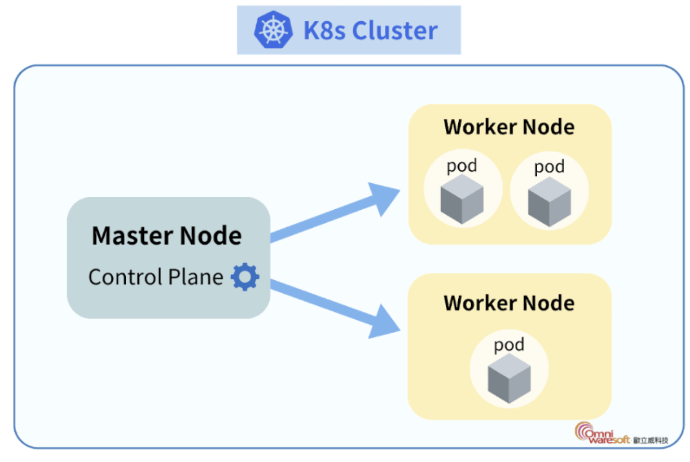

## Kuberetes 簡介摘要

K8s（Kubernetes）是一個開源平台，用於**自動化部署**、**管理和擴展容器化應用**。它的好處包括：提高應用的可用性和可靠性，因為能**自動處理應用崩潰和重啟**；提升資源利用率，通過動態調整應用所需資源；簡化運維，支持滾動更新和回滾，減少停機時間；方便擴展，輕鬆應對流量峰值需求。因此，使用 K8s 可以幫助企業更高效地管理和運營應用，支持快速迭代的開發模式。

## 為什麼要用 K8s

### 以圖片辨識服務為例

假設我們有一個圖片辨識的模型，需要部署到環境中並線上提供即時推理服務。

#### 不用 K8s 的情況下

當管理機器學習推理服務時，你可能會使用 Docker 來封裝模型。你需要手動構建和推送 Docker 映像到鏡像倉庫。然後，逐一在各個伺服器上運行容器，配置 Docker 網絡來連接各個服務，例如，推理服務與數據庫。你還需要設置反向代理然後手動調整管線以便負載均衡。此外，針對流量高峰，你需要監控資源使用並手動啟動更多容器。

詳細內容可以參考先前我在部署 MLOps 環境的案例 ([Machine Learning Model Serving](https://github.com/kiangkiangkiang/Machine-Learning-Model-Serving))，在該案例中，我們全程使用 `docker-compose` 將各個節點組裝，然而真實生產環境中，**大多是跨機器運行**，情況會更複雜許多，需要考量更多的網路配置。並且發生意外事件時（例如某個節點因為流量暴增或是程式 Bug 而中斷），整個服務可能因此終止，這些情況皆需要手動重啟或恢復狀態。

#### 使用 K8s 的情況下

你只需編寫部署 YAML 文件，定義模型容器的需求，K8s 會負責拉取映像並在集群中安置容器。服務發佈後，**K8s 自動處理容器間的網絡配置**，使推理服務能與其他資源輕鬆交互。同時，K8s 的內建服務發現和**自動負載均衡功能能確保流量被均衡分配**，而其**自動擴縮功能**則透過監控資源使用，無需人工干預即可啟動或關閉容器來應對流量變動，減輕了整合和運維的負擔。

### 用 Docker Compose 就解決部署問題了？

在先前文章中，我們都是透過 `docker-compose` 處理多個容器部署問題，但實際上都還是**在同一個機器上**，也就是共享相同的硬體資源，然而遇到高流量的情況，顯然一台機器是不夠的，會**需要多台機器都服務同樣的 Container**，而 K8s 的微服務管理叢集**能將多個 Container 自動分派到多台主機上，並監控每個 Container 的運行狀態。** 神奇吧，只要環境設定好，我們後續的部署服務都不需要手動進入一堆機器做設定，**只需要在同一台機器上，就能分發我們想要服務的 Container。**

#### 因此，在高流量高負荷或是大型服務集群的情況下，K8s 能有更高的擴展性和可靠性和便利性。

## K8s 基本框架與概念

### 框架簡介 (Cluster/Master/Worker)

在 K8s 中，**Cluster (集群)** 可以視為一個完整的服務單位，也就是由 Master 跟 Worker 所組成的一堆的機器。可以想像這些機器會**共同處理一個服務**，例如在 Chatbot 中，可能就會有很多台機器 (worker node) 負責模型推論，但在高流量的情況下，要把當前輸入的對話傳給哪台機器去推論，就是 master node 要去處理的問題，而包含 DB, Web APP 等，也都會是 worker node 所服務的 container，因此一個 Cluster 可以視為一大堆機器共同處理一個服務。

- **Node**: 可以視為一台機器，例如你正在使用的 Mac, Windows, Linux, AWS EC2, GCP Compute Engine 等。擁有一個**獨立的硬體配置資源**。Node 又可以依照在做的任務分成 Master Node, Worker Node。
- **Master Node**: 想像成人體的大腦，負責**發號命令**。
- **Worker Node**: **處理真正的服務內容**，例如 DB, APP, Inference Endpoint, Training Endpoint，一個 Worker Node 通常可能會同時存在很多個應用 (Pod)，因此會被配置較多的運算資源。

**注意：Worker Node 就是*計算資源*，可以想像成一個完全空的機器，等待被使用，在 K8s 框架下，不需要手動進入 Worker Node 內部開發，只需要在把我們開發好的 image 寫入配置檔，後續 K8s 就會自動把這個應用程式分配進 Worker Node。**

具體示意圖如下：

    </img>

其中，Pod 為 K8s 中的最基本單位，也就是未來如果要做部署、自動擴展等等，都是**以 Pod 為單位去做**。而一個 Pod 內可能包含多個 Container，通常基於相同的生命週期、傳輸效率等做管控。而 K8s 也會自動將 Pod 分給 Node（通常會依照資源等分派）。

#### 何時會把一堆 Container 放在同一個 Pod

**放在同個 Pod 的案例**
- 在建 Airflow 時，會需要有 webserver 和 scheduler 等**相互依賴**的 container。就會放在同一個 Pod。
- 在建立模型推理服務時，常見的情況會多起一個健康檢查的 Container，定時訪問模型推理服務，因此兩者間也有**相同的生命週期**，也會放在同一個 Pod。

**分開 Pod 的案例**
- 例如模型推理服務和 DB 通常不會放在同一個 Pod，因為推理服務多數時候需要自動擴展，但 DB 沒有此需求（生命週期不同），因此通常會分開。

#### Pods 工作分配案例

舉個實際的例子來解釋上面的架構圖，想像我們手上有三台機器（A, B, C），共同處理**LLM 自動訓練的任務**，A 機器負責作為大腦，進行資源調度與分配（並不實作真正的應用服務）。B, C 作為 Worker Node，可視為現有資源，後續 K8s 會自動把我們的需求任務自動分配到 B, C 上。而以此任務來說，可能會有 3 個 Pods：
1.  DB 服務與 MLflow 服務（包含 Web Tracking Server, Artifact 等）
2.  模型訓練服務，自動從 DB 撈處理好的資料跑訓練流程，並且把訓練好的模型放在 MLflow 內的 Artifact。
3.  爬蟲服務與前處理服務，定期上網撈資料 (CronJob)，並進行前處理後存入 DB。並且觸發模型訓練服務 (Event)。

在 Pods 建立好後（在某台機器上把訓練程式寫好後打包成 image，之後透過 yaml file 使用），K8s 便會自動把這些 Pods 分配到有資源的 Worker Nodes。以上圖來說，訓練的 Pod 可能就在獨立一個 Node（資源需求高），其他兩個 Pod 可能被自動分配在同一個 Node 內。

