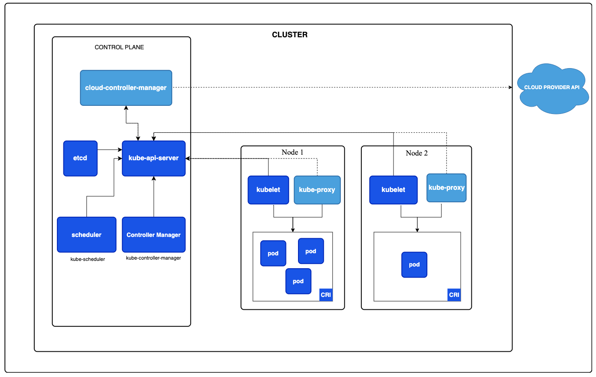
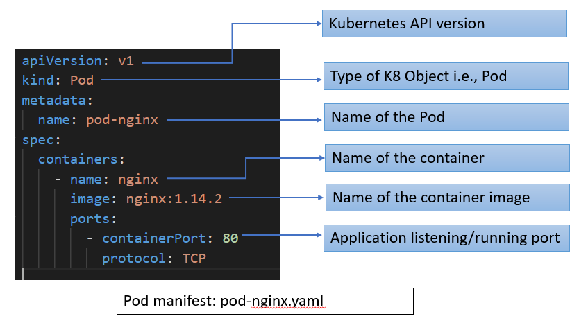

## K8s Component

有別於[上一章](chapter1-basic-concept.md)從 K8s 應用情境切入介紹，本章將更著重在實際內部元件的概述。包含介紹上一章提到的 Control Plane、Node 等結構中，內部有什麼組成？彼此間資料如何傳遞？而在了解這些細節後，未來在實作上會更清楚如何建立一個 Control Plane 以及 Node。

以下為基礎 K8s 架構範例（可能會因為不同服務建置需求而有不同），後續將透過此架構圖進一步說明內部細節。

### 1. Control Plane

#### kube-apiserver

1. 處理所有打進 Control Plane 的 API 請求。
2. K8s 內部資源管控中心：對所有 K8s 資源實現 CRUD 等操作。
3. 身份認證中心：檢視所有打進來的流量（用戶）是否有對應請求資源的權限。

通常，在 K8s 內，管理集群資源的指令會使用`kubectl`，而當開發人員使用此指令時，實際上會直接打到 kube-apiserver 內，由 kube-apiserver 處理所有後續的操作。

舉例來說，假設我們已經把 K8s 集群架好，接著要開始把一些微服務配置到 K8s Node 內，因此我們會在 Control Plane 上透過 `kubectl apply -f my_service.yaml` 來把我的服務 (my_service) 推進集群內，此時，實際上接收到`kubectl`訊息的是 Control Plane 內部的 kube-apiserver，而會依序進行以下幾件事情：
1. 確認當前使用者是否有足夠權限執行此操作：例如我想起一個 Nginx 服務，kube-apiserver 會檢視我是否有足夠權限起。
2. 假設權限足夠，kube-apiserver 接著會把我寫好的配置 `my_service.yaml` 存到 [etcd](#etcd) 內部，將此配置作為集群的一部分。
3. 同時，因為 [controller-manager](#controller-manager) 持續監聽 kube-apiserver，因此當新的服務要被建置時，controller-manager 會以事件驅動的方式知道「有服務更新了」，此時 controller-manager 會主動打到 kube-apiserver 取得此服務的 Spec，並且建立相對應的資源（Pod or other）。

#### etcd

#### controller-manager

#### cloud-controller-manager (Optional)

和雲平台溝通的節點，主要是 K8s 服務如果有用到雲端資源時，會透過 Cloud Controller Manager 來管控使用雲端的服務（沒用到就不用這個節點）。例如，假設我們建立一個 K8s 服務，其中會使用 AWS LoadBalancer，則就會在此節點管控兩者之間的交互。

### Node

### Addons

## K8s Initialization Workflow

### Workflow

### Kubernetes Manifest

## K8s Command

### kubectl

### kubeadm

next study component and command

- Kubernetes Manifest: 組態文件，K8s 起服務主要透過此文件來管控，通常是 YAML 格式，基本可以想像成跟 Dockerfile 或 Docker-Compose 差不多，都是透過宣告的方式來控制服務間的連結以及服務本身的規格，如下：

https://www.omniwaresoft.com.tw/product-news/k8s-introduction/