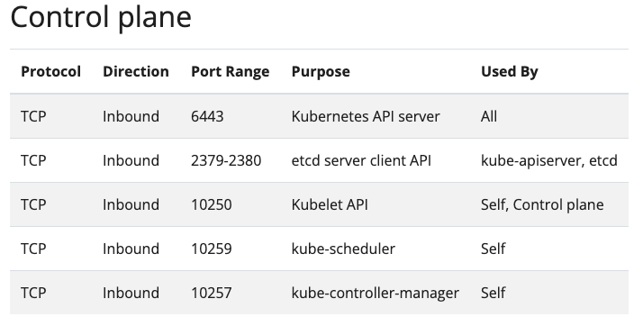
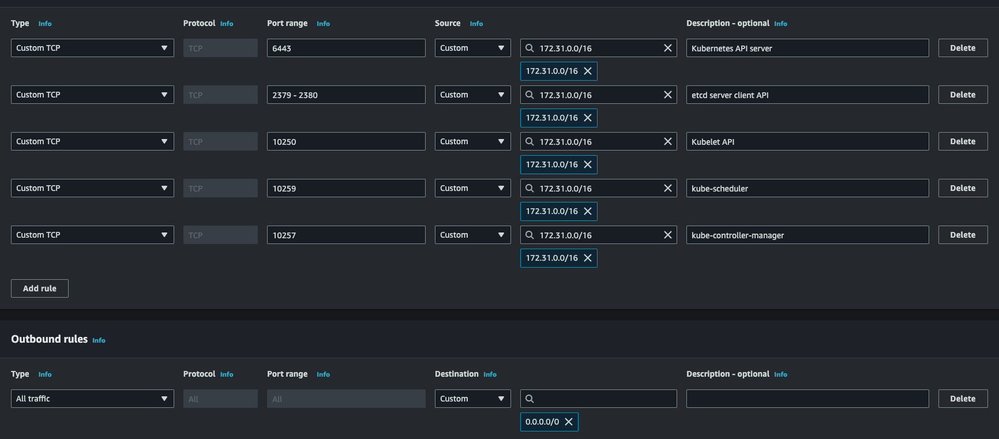
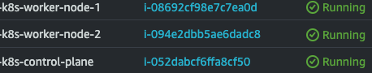
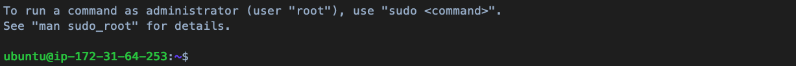

# K8s Cluster on AWS EC2

[01_kubernetes_introduction](/01_kubernetes_introduction/) 已概述完基礎的 K8s 元件及概念，透過此概念，我們已經能夠自行手動建置一個簡單的 K8s Cluster。

透過 AWS 雲端資源，簡單模擬實際的生產環境，我們使用 AWS EC2（雲端的虛擬機器）來模擬多台主機的情境，本文也將著重在如何透過 `kubeadm` 建置基礎集群。

*注意：AWS 有提供無伺服器且可快速建置 K8s 的服務：AWS EKS。而在此使用 EC2 的原因僅為了 DEMO 手動建置集群的流程，因此實際使用雲服務，建議依照 EKS 建置即可。*

## Launch AWS EC2

首先，整個集群預計規劃成 1 台 Controll Plane Node 以及 2 台 Worker Node，因此需要到 AWS EC2 控制面板中，起三台 EC2，流程如下：

至 AWS 控制版面 -> 登入你的組織 -> 在 Search 的地方搜尋「EC2」-> 點進去後選擇「Launch instance」

接著就可以開始進行虛擬機的基礎配置設定（包含硬體、規格、網路等等）

以下配置我是重複做三次，因為名字的部分我都有根據目的有改變，實際上也可以配置一次後，到 **Number of instances** 設定成想要開的 EC2 數量也可以。

### Application and OS Image

最上面直接輸入你要的名字（可以加上 worker node 或是 controll plane 來簡單區分這台機器的用途）。

在 OS Image 的部分，根據此 K8s 的集群的用途自行配置，而我們在後續 [03_launch_k8s_services](/03_launch_k8s_services/) 時，會使用 Machine Learning 相關模型進行微服務，因此 OS Image 的部份選擇有 GPU 的即可（選擇有 GPU 的 Image 才會有裝好的 CUDA Driver，不然的話要自行手動裝）。

在此我選 **Nvidia Driver AMI GPU PyTorch 2.4 (Ubuntu 22.04)**

### Instance Type & Key Pairs

#### Instance Type

Instance Type 為機器計算資源的規格，也就是 CPU, GPU 等規格，在 AWS 官方文件有介紹每個 Instance Type 的規格差異，越高規當然也越貴，計價方式為每小計價。

在 EC2 中，這些配置除了 OS 以外都是可以動態配置的，也就是起了 EC2 之後，想改的時候也可以改。因此這裡先選低規的 **t2.xlarge**。

通常，Worker Node 的計算規格需要往上拉，因為跑 ML 模型通常會使用 GPU，而 Controller Plane 並不會真正服務模型，因此規格相較之下可以選較低的，但在此先都選 **t2.xlarge**，等未來真的有服務準備推上去時，再動態調整即可。

#### Key Pairs

Key Pairs 就是連進 EC2 的鑰匙，手上要有相對應的鑰匙才能連，因此在這裡要創建一個鑰匙，後續就用它來連。

這裡不特別設定，讓系統自行產生即可。

#### Network & Storage

Network 的部分主要需要確保三台機器彼此可以正常溝通，K8s [官方](https://kubernetes.io/docs/reference/networking/ports-and-protocols/#control-plane)有提供每個節點需要對外的 Port 以及其用途：

透過上表，我們需要為每台機器自行建立 Security Group（防火牆），所以搜尋 Security Group，然後根據上表建立兩個 Security Group，分別配至給對應的機器。

例如 Control Plane 的 Security Group 配置如下：

Inbound rules 代表控制哪些 IP 能夠打進來，其中，`172.31.0.0/16` 為 VPC 的網域（請檢視自己的 VPC 網域），代表接受所有在同一個 VPC 網域打到對應 Port 的流量，而 Outbound rules 則表示能夠到哪些 IP。

以上為設定 K8s Cluster 內網連接的必要通道。

接著，在每個 Security Group 的 Inbound rules 增加一條自己的 IP，且選擇 Customize TCP Port 22，用來做 SSH 連線，這條通道是設定給自己當前的工作機器，要透過 SSH Key 連到遠端 EC2 機器的通道。

建立好兩個 Secutity Group 後，回到起 EC2 的頁面，根據當前 EC2 的類型選擇對應的 Security Group（Control Plane 就選 Control Plane 的 Security Group）

所以在 Firewall (security groups) 中，選擇 Select existing security group，選剛剛建好的。

*如果發生 Security Group 和 所選的 VPC 不同，重新整理即可*

最後，Storage 選擇 100 GiB 即可。

回到 EC2 控制台頁面，顯示以下 running 畫面就代表成功了。

## Connect to AWS EC2

點進建好的機器，上面看到的 `Public IPv4 address` 就是這台機器對外開放的 IP，點選 Connect 照著上步驟走，就可以從自己的機器連進 AWS EC2。

連進去如果有以下頁面就代表成功:

