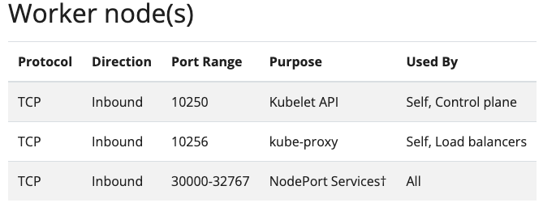

在[上一章](/02_environment_setup/chapter2-2-kubernetes-setup.md)已經建置好了一個 K8s 集群，但實際上要部署什麼服務到 Cluster 內，就依照團隊需求而定。當團隊確定了開發項目後，會在團隊的實驗機器上進行開發，而經過嚴謹測試後，會將開發好的 Image 推送到 Container Registry，隨後，開發團隊會建立 `K8s 配置檔`，也就是用 `yaml` 組成的各個服務設定與串接設定等，最終使用 `kubectl apply` 將配置檔推送到 Cluster 內，在權限正確的情況下，Cluster 就會按照配置檔做服務的部署。

在小型團隊、實驗環境等等，一個簡單的 K8s 開發流程如下圖：
 


真正環境下，管理 K8s 人員，會有更多權限設置，也就是開發團隊可能會有不同的集群互動權限，這是要依靠 K8s 管理人員來決定的，而 K8s 管理人員建立好特定權限的角色後，就會把該設定檔 (`kubeconfig`) 交給開發人員，由開發人員自行和 Cluster 互動。

本節對主要的就是要配置好開發人員的環境，讓未來的開發人員拿到 `kubeconfig` 後，都可以自行做服務上版，這在**小型團隊**內相當適用。

## kubectl Installation (DEV. NODE)

在開始開發前，要先確保能夠只用 `kubectl apply` 並且確保開發機器上有 `kubeconfig`，這樣機器才會正確的推送部署服務的配置檔到正確的 Cluster 內。

在[官方介紹](https://kubernetes.io/zh-cn/docs/reference/kubectl/)中，有提供安裝最新版本 kubectl 的指令，但為了避免有任何版本衝突的可能性，在實驗階段，我們依照上一章所建置的版本（v1.31.0）來安裝。

```sh
sudo curl -LO https://dl.k8s.io/release/v1.31.0/bin/linux/amd64/kubectl
```

接著下載 kubectl 驗證的檔案，一樣以特定版本為主：

```sh
sudo curl -LO https://dl.k8s.io/release/v1.31.0/bin/linux/amd64/kubectl.sha256
```

透過上述的驗證檔案，針對執行檔進行驗證（若輸出 OK 代表驗證成功）：

```sh
sudo echo "$(cat kubectl.sha256)  kubectl" | sha256sum --check
```

驗證成功後，用以下指令真正開始進行安裝：

```sh
sudo install -o root -g root -m 0755 kubectl /usr/local/bin/kubectl
```

最後，看看是否安裝成功：
```sh
kubectl version --client --output=yaml
```


也可以用上一章提供的 Command Line Tool 方法安裝（只安裝 kubectl 即可），兩個方法都是官方提供的，自己選一個就好。

## Get kubeconfig (CONTROL PLANE)

正常情況下，需要透過配置好權限的 yaml 檔案，來和 Cluster 建置角色權限，後續才可以針對特定角色生成該權限。

### Build Account

本地端環境設定好後，就可以跟 K8s 維運團隊請求 `kubeconfig`，這裡我們影分身成維運團隊，幫忙建置一個 Account，讓另一個分身能夠順利開發推服務。

*Note: 正常我們用 `kubeadm init` 後，會自動生成一個管理者憑證，預設在 `.kube/config` 中，但通常不會把管理者權限暴露，因此需要手動生成另一個憑證，即開發者憑證，讓開發人員就由此憑證訪問 Cluster。*

#### IP Setting

在這之前，由於我本身開發的機器和 Cluster 是在不同內網（若在同一個內網，可以直接跳過這一小節），而 K8s Cluster 本身預設僅限於內網溝通，也就是當有人透過 Public IP 訪問集群，會有 `Unable to connect to the server: tls: failed to verify certificate: x509: certificate is valid for CLUSTER_IP, MASTER_IP, not PUBLIC_IP` 此錯誤。

原因是我們一開始用 `kubeadm init` 時，系統會自動生成憑證，這些檔案會去認證哪些 IP 能訪問 Cluster，而依照預設，Cluster 僅開放內網的 IP 訪問，因此這節要手動將 Public IP 更新到 Cluster 內，這樣未來就能夠透過 Public IP 訪問 Cluster。

1. 先簡單備份原本的憑證檔案
```sh
mkdir ~/my-crt-backup
cd /etc/kubernetes/pki
mv apiserver.crt ~/my-crt-backup/
mv apiserver.key ~/my-crt-backup/
```

2. 生成新的憑證
使用 `kubeadm` 初始化生成憑證的階段 `phase certs apiserve`，也就是重新生成一個新的憑證：
```sh
kubeadm init phase certs apiserver --apiserver-advertise-address {MASTER_IP} --apiserver-cert-extra-sans {PUBLIC_IP}
```
- MASTER_IP：內網的 IP，可以用 `kubectl cluster-info` 來檢查。
- PUBLIC_IP：就是 kube-apiserver 的 Node 的 Public IP。未來就可以用此 IP 訪問 Cluster。


3. 刷新 `admin.conf` 文件，在 `/etc/kubernetes/admin.conf` 內有集群的憑證訊息，我們上一步創造了新的憑證，因此這個檔案也要跟著更新。
```sh
kubeadm alpha certs renew admin.conf
```

此時用 `kubectl get nodes` 應該都能正常顯示，若無法取得資訊，使用 `systemctl restart kubelet` 重啟，讓 kubelet 也更新所有配置資訊。


#### Create Account

首先，為整個集群創建一個 Role，並且賦予對應的權限（此範例先權限全開，未來可依照自行需求進行配置）。Role 有 Role or ClusterRole，不同的 Role 只能訪問自己命名空間的資源（類似 container 會切很多區塊，彼此互不干擾）而 ClusterRole 不受命名空間限制。


1. 建立一個檔案 `cluster-admin-role.yaml`，定義 ClusterRole 可以使用的**權限範圍**。

```yaml
apiVersion: rbac.authorization.k8s.io/v1
kind: ClusterRole
metadata:
  name: my-cluster-admin
rules:
- apiGroups: ["*"]
  resources: ["*"]
  verbs: ["*"]
```

2. 建立一個檔案 `cluster-admin-binding.yaml`，將上述的權限範圍綁定特定用戶 `my-ec2-developer` 身上。如此一來，就會創建一個 Account: my-ec2-developer，並且權限範圍就是 `roleRef` 內的 `my-cluster-admin`。

```yaml
apiVersion: rbac.authorization.k8s.io/v1
kind: ClusterRoleBinding
metadata:
  name: my-cluster-role-binding
subjects:
- kind: User
  name: my-ec2-developer # 用實際的使用者名稱替代
  apiGroup: rbac.authorization.k8s.io
roleRef:
  kind: ClusterRole
  name: my-cluster-admin
  apiGroup: rbac.authorization.k8s.io
```

3. 使用 `kubectl apply -f` 讓上述設定生效，在 K8s 有趣的一點就是，可以把寫 `yaml` 想像成在寫程式，像 Python, C 之類的，最後用 `kubectl apply -f` 相當於對寫好的程式進行 compile。因此上述我們寫好一支創建角色的程式了，可以 compile 它了。
```sh
kubectl apply -f cluster-admin-role.yaml
kubectl apply -f cluster-admin-binding.yaml
```   

最後，透過 `kubectl get clusterroles | grep my-cluster-admin` 就可以看到我們建立好的 `clusterroles`。

或是想看有沒有綁定成功，可以透過 `kubectl describe clusterrolebinding my-cluster-role-binding` 查看。


#### Update Certificate


```sh
sudo openssl genrsa -out developer.key 2048
sudo openssl req -new -key developer.key -out developer.csr -subj "/CN=developer/O=development"
```


```sh
sudo openssl x509 -req -in developer.csr -CA /etc/kubernetes/pki/ca.crt -CAkey /etc/kubernetes/pki/ca.key -CAcreateserial -out developer.crt -days 365
```

#### Create Account


回到 EC2 中的 Control Plane 那台機器中，


要先跑開放 public IP

然後 openssl 創建憑證

openssl genrsa -out developer.key 2048

# 用私鑰生成一個憑證簽名請求 (CSR)
openssl req -new -key developer.key -out developer.csr -subj "/CN=developer/O=developers"

# 使用集群的 CA 來簽署 CSR，以生成一個簽名憑證
openssl x509 -req -in developer.csr -CA /etc/kubernetes/pki/ca.crt -CAkey /etc/kubernetes/pki/ca.key -CAcreateserial -out developer.crt -days 365


sudo base64 -w 0 /etc/kubernetes/pki/ca.crt 

sudo base64 -w 0 my-ec2-developer.key 

base64 -w 0 my-ec2-developer.crt


然後原本的那個憑證要更新這個

最後創建角色


配置好相關的 kubeconfig，再將此 config 傳給其他開發機上。

第一步，先在集群內辦帳號！有個集群的角色，後續的開發機就以這個角色登入。

手動建立一個 .yaml 檔案，命名為 `build-account.yaml`，內容會在[部署的章節](/03_LLM_full_finetune_on_k8s/chapter3-2-training-llm-on-k8s.md)專門介紹！

```yaml
apiVersion: v1
kind: ServiceAccount
metadata:
  name: my-developer
  namespace: default
```


然後推進 Cluster 內：
```sh
kubectl apply -f build-account.yaml
```


get master ip: kubectl cluster-info
get cluster ip: kubectl get svc kubernetes
