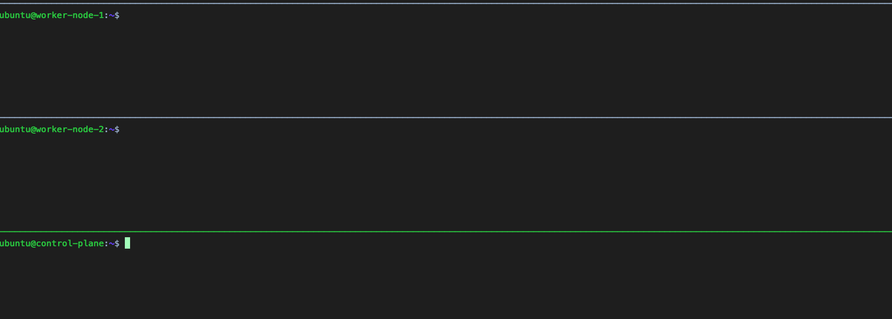
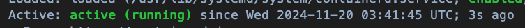

# K8s Cluster on AWS EC2

在 [chapter1-ec2-setup](/02_environment_setup/chapter1-ec2-setup.md) 中起好 EC2 後，就可以開始進行 K8s 的集群設定。

## Command line tool

以下會先介紹三個常見的 command line 工具，每個工具的使用層級不同。

後續在建置集群的時候，會常使用到此三個指令，因此只要看是使用哪個指令，就可以知道對應要操作的層級。

### kubeadm

kubeadm 為**集群整體**的管理工具，用來快速搭建 K8s 集群，它簡化了集群安裝和配置過程中的許多手動操作。基本上建起來後就會比較少使用 kubeadm。

但因為是集群整體的工具，所以未來整個集群要重新啟用，或是有新的 Node 要加入集群，或集群升級，都還是會需要 kubeadm。

同時也藉由 kubeadm 生成相關配置檔案和開啟集群所需的一些元件。

### kubectl

kubectl 為**集群內部**的管理工具。和[上一章](/01_kubernetes_introduction/chapter2-component-details.md)介紹的一致，使用者用此指令會直接打到 kube-apiserver。

而 kube-apiserver 就是作為整個集群的資訊中心，大部分元件都會監聽此元件，並且也是對 etcd 的唯一窗口，因此可以做**集群內部**的管控。

比如創建、查看、更新、刪除 Pods、Services、Deployments 等資源。

若不熟悉集群內部操作，可以看[上一章](/01_kubernetes_introduction/chapter2-component-details.md)的介紹。

### kubelet

kubelet 為 **Worker Node 的管理工具**。一樣在[上一章](/01_kubernetes_introduction/chapter2-component-details.md)有介紹。

kubelet 是每個 Worker Node 都有的元件，主要會監聽 kube-apiserver，並且對自己的 Node 進行管控。

因此未來如果要進入特定的 Node 重啟或是查看 Node 內的 Pod 運行狀況等等，都可以用此指令來看。

## Cluster Setup

基本的集群建立，大致分成以下幾個步驟，其中每個步驟的差異順序等會依照需求而有所不同：

安裝和配置 Container Runtime → 安裝 Kubernetes command line tool → 初始化集群 (kubeadm init) → 配置網絡插件 ([CNI](#network-setup)) → 加入 Worker Node。

### Rename host (Optional)

目前我們有三台 EC2 機器，但預設情況下，比較難區分哪台機器的任務是什麼，後續在建置可能會困惑。

首先輪流進去三台機器，把原本裸露在外的 Private IP，改成所屬的類別，使用以下指令：

```sh
sudo hostnamectl set-hostname control-plane
```

之後重新連進去即可（記得把`control-plane`替換成你想要的對應名稱），改完後顯示這樣就代表成功。



### Preparation Work

#### 1. Turn off swap

正常的系統，可能會使用 Swap memory 的內存管理技術，也就是系統將不常用的 RAM 轉到硬碟的技術，這樣可以解決 RAM 不夠的問題，只是常這樣做會讓效率變慢（硬碟讀寫慢很多）。

而 Kubernetes 的 kubelet 預設情況下**不支援在節點啟用 Swap 的情況下運行**。因為 Kubernetes **希望能夠準確判斷和管理節點上的資源分配和利用**。如果允許 Swap，被調度到該節點的容器可能會因 Swap 而遭受性能問題，從而影響應用程式的運行。

所以當系統啟用了 Swap 時，**kubelet 將不會啟動**，這是一種防範措施。這樣可以確保所有正在運行的 Pod 都是基於可靠的記憶體配置，而不是依賴 Swap。

因此要先到每個節點跑以下指令：

```sh
sudo swapoff -a
```

`swapoff` 就是禁用特定的儲存區塊，`-a` 的 a 就是 all，也就是所有交換區都禁用。

#### 2. Modules Setup

在集群網路架構實作上，這裡預計使用 `Weave` 的 [CNI 套件]((#network-setup))，而為了讓每個流量能正常透過 `iptables` 過濾（也就是正常參照 K8s Framework 運行），因此安裝 `br_netfilter` 套件，藉由該套件的設定，讓每個網段的流量，經由網橋通過時，能正常轉發過去：

```sh
cat <<EOF | sudo tee /etc/modules-load.d/k8s.conf
br_netfilter
EOF

sudo modprobe br_netfilter
```

套件內部可配置的兩個參數：

- `net.bridge.bridge-nf-call-iptables`: 跨網橋間是否允許流量經由 iptables 過濾（轉發），1 or 0。
- `net.bridge.bridge-nf-call-ip6tables`: 跨網橋間是否允許流量經由 ip6tables 過濾（轉發），1 or 0。


且正常情況下，Linux 不允許 IPv4 的封包轉發，也就是當流量打到一台 Linux 系統，預設是無法轉到另一個 IP 位置。但在 Cluster 內，流量會自動分配，因此需要再設定以下參數：

- `net.ipv4.ip_forward`: 是否允許系統直接藉由 IP 轉發封包，1 or 0。

整合以上兩個配置，Script 如下：
```sh
cat <<EOF | sudo tee /etc/sysctl.d/k8s.conf
net.bridge.bridge-nf-call-iptables  = 1
net.bridge.bridge-nf-call-ip6tables = 1
net.ipv4.ip_forward                 = 1
EOF
```

最後使用指令重新加載系統配置：

```sh
sudo sysctl --system
```

`k8s.conf` 落檔在 `sysctl.d` 內，也就是系統的內核參數，因此 `sysctl --system` 可以順利重新加載，讓其生效。

補充：網橋（bridge）就是處理不同網段間，如何整合成一個大網路中間介接的橋樑，也就是兩個網路要整合成一個共同網路，中間會由 bridge 當接口。而因為 Cluster 內部網段非常複雜，每個 Pod 間可能都有自己的網段，因此為了確保每條傳輸路徑都符合 `iptables`規則，才要設定 `net.bridge.bridge-nf-call-iptables`，如此一來，kube-proxy 動態更新 iptables 後，在各個流量傳導途徑都會生效。


### Container Runtime Installation

開始正式安裝 [Container Runtime](/01_kubernetes_introduction/chapter2-component-details.md#22-container-runtime)！

這裡使用 `containerd` 作為 Container Runtime，詳細介紹可以參考[官方文件](https://github.com/containerd/containerd/blob/main/docs/getting-started.md)。

或是[這裡](https://k8s.huweihuang.com/project/runtime/containerd/install-containerd)也有中文的安裝介紹。

#### Containerd Installation

```sh
sudo apt-get update
```

```sh
sudo apt-get -y install containerd
```

#### Containerd Config Setup

```sh
sudo mkdir -p /etc/containerd
```

```sh
sudo containerd config default | sudo tee /etc/containerd/config.toml
```

依照[官方推薦](https://kubernetes.io/zh-cn/docs/setup/production-environment/container-runtimes/#containerd-systemd)，開啟 `/etc/containerd/config.toml` 檔案，並在內部設定`SystemdCgroup = true`如下：
```json
[plugins."io.containerd.grpc.v1.cri".containerd.runtimes.runc.options]
  SystemdCgroup = true
```

重啟 Containerd，讓所有設定效：
```sh
sudo systemctl restart containerd
```

最後跑以下指令來看是否成功：
```sh
service containerd status
```
有 active 就成功了！



### Kubernetes Command Line Tool Installation


### Network Setup

由[上一章](/01_kubernetes_introduction/chapter2-component-details.md)可以知道，在整個集群的網路，基本上是依靠`kube-proxy`動態更新`iptables`，實際上的網路傳導就是由更新好的`iptables`進行過濾。

那實際上 iptables 內管理每個 Pod 的 IP，以及他們是走哪條網路，這些是怎麼來的？

在 K8s 內部的網路通信，依靠 CNI (Container Network Interface) 的規範進行，他負責管理和配置容器 (Pod) 的網絡接口，使得 Pod 能夠在 Cluster 中通信。也就是，**要先有 CNI 提供好的網路基建，把網路建立起來，分配給每個 Pod IP，後續 kube-proxy 才能藉由這個網路基建，動態更新 iptables。**因此，沒有 CNI，相當於 Cluster 完全不能通信，也建立不起來。

常見實作 CNI 規範的套件，如下表：

| CNI 插件  | 是否需要配置 `net.bridge.bridge-nf-call-iptables` | 支持的網絡策略 (NetworkPolicy) | 加密支持   | 使用的網絡技術            |
|-----------|--------------------------------------------------|-------------------------------|-----------|--------------------------|
| Calico    | 否                                                | 是                             | 選擇性加密 | 原生路由/BGP              |
| Flannel   | 視後端而定（如 VXLAN 通常需要）                     | 否（需與其他插件配合如 Calico）  | 否         | Overlay (VXLAN 等)        |
| Weave Net | 是                                                | 是                             | 是         | Overlay 網絡 (Weave 網狀) |


