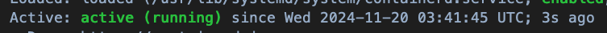

# K8s Cluster on AWS EC2

在 [chapter3-ec2-setup](/02_environment_setup/chapter3-ec2-setup.md) 中起好 EC2 後，就可以開始進行 K8s 的集群設定。

照著本篇所有 Code Block 跑，基本上就能起好 K8s Cluster，**注意有些是要進入檔案內部手動修改設定，並不是單純的 Script，且有的是要在 Control Plane 跑，有的是要在 Worker Node 跑**。

## Command line tool

以下會先介紹三個常見的 command line 工具，每個工具的使用層級不同。

後續在建置集群的時候，會常使用到此三個指令，因此只要看是使用哪個指令，就可以知道對應要操作的層級。

### kubeadm

kubeadm 為**集群整體**的管理工具，用來快速搭建 K8s 集群，它簡化了集群安裝和配置過程中的許多手動操作。基本上建起來後就會比較少使用 kubeadm。

但因為是集群整體的工具，所以未來整個集群要重新啟用，或是有新的 Node 要加入集群，或集群升級，都還是會需要 kubeadm。

同時也藉由 kubeadm 生成相關配置檔案和開啟集群所需的一些元件。

### kubectl

kubectl 為**集群內部**的管理工具。和[上一章](/01_kubernetes_introduction/chapter2-component-details.md)介紹的一致，使用者用此指令會直接打到 kube-apiserver。

而 kube-apiserver 就是作為整個集群的資訊中心，大部分元件都會監聽此元件，並且也是對 etcd 的唯一窗口，因此可以做**集群內部**的管控。

比如創建、查看、更新、刪除 Pods、Services、Deployments 等資源。

若不熟悉集群內部操作，可以看[上一章](/01_kubernetes_introduction/chapter2-component-details.md)的介紹。

### kubelet

kubelet 為 **Worker Node 的管理工具**。一樣在[上一章](/01_kubernetes_introduction/chapter2-component-details.md)有介紹。

kubelet 是每個 Worker Node 都有的元件，主要會監聽 kube-apiserver，並且對自己的 Node 進行管控。

因此未來如果要進入特定的 Node 重啟或是查看 Node 內的 Pod 運行狀況等等，都可以用此指令來看。

## Cluster Setup

基本的集群建立，大致分成以下幾個步驟，其中每個步驟的差異順序等會依照需求而有所不同：

安裝和配置 Container Runtime → 安裝 Kubernetes command line tool → 初始化集群 (kubeadm init) → 配置網絡插件 ([CNI](#network-setup)) → 加入 Worker Node。

### Rename host (Optional) (ALL NODE)

目前我們有三台 EC2 機器，但預設情況下，比較難區分哪台機器的任務是什麼，後續在建置可能會困惑。

首先輪流進去三台機器，把原本裸露在外的 Private IP，改成所屬的類別，使用以下指令：

```sh
sudo hostnamectl set-hostname control-plane
```

之後重新連進去即可（記得把`control-plane`替換成你想要的對應名稱），改完後顯示這樣就代表成功。


### Preparation Work（ALL NODE）

#### 1. Turn off swap

正常的系統，可能會使用 Swap memory 的內存管理技術，也就是系統將不常用的 RAM 轉到硬碟的技術，這樣可以解決 RAM 不夠的問題，只是常這樣做會讓效率變慢（硬碟讀寫慢很多）。

而 Kubernetes 的 kubelet 預設情況下**不支援在節點啟用 Swap 的情況下運行**。因為 Kubernetes **希望能夠準確判斷和管理節點上的資源分配和利用**。如果允許 Swap，被調度到該節點的容器可能會因 Swap 而遭受性能問題，從而影響應用程式的運行。

所以當系統啟用了 Swap 時，**kubelet 將不會啟動**，這是一種防範措施。這樣可以確保所有正在運行的 Pod 都是基於可靠的記憶體配置，而不是依賴 Swap。

因此要先到每個節點跑以下指令：

```sh
sudo swapoff -a
```

`swapoff` 就是禁用特定的儲存區塊，`-a` 的 a 就是 all，也就是所有交換區都禁用。

#### 2. Modules Setup

在集群網路架構實作上，這裡預計使用 `Weave` 的 [CNI 套件]((#network-setup))，而為了讓每個流量能正常透過 `iptables` 過濾（也就是正常參照 K8s Framework 運行），因此安裝 `br_netfilter` 套件，藉由該套件的設定，讓每個網段的流量，經由網橋通過時，能正常轉發過去：

```sh
cat <<EOF | sudo tee /etc/modules-load.d/k8s.conf
br_netfilter
EOF

sudo modprobe br_netfilter
```

套件內部可配置的兩個參數：

- `net.bridge.bridge-nf-call-iptables`: 跨網橋間是否允許流量經由 iptables 過濾（轉發），1 or 0。
- `net.bridge.bridge-nf-call-ip6tables`: 跨網橋間是否允許流量經由 ip6tables 過濾（轉發），1 or 0。


且正常情況下，Linux 不允許 IPv4 的封包轉發，也就是當流量打到一台 Linux 系統，預設是無法轉到另一個 IP 位置。但在 Cluster 內，流量會自動分配，因此需要再設定以下參數：

- `net.ipv4.ip_forward`: 是否允許系統直接藉由 IP 轉發封包，1 or 0。

整合以上兩個配置，Script 如下：
```sh
cat <<EOF | sudo tee /etc/sysctl.d/k8s.conf
net.bridge.bridge-nf-call-iptables  = 1
net.bridge.bridge-nf-call-ip6tables = 1
net.ipv4.ip_forward                 = 1
EOF
```

最後使用指令重新加載系統配置：

```sh
sudo sysctl --system
```

`k8s.conf` 落檔在 `sysctl.d` 內，也就是系統的內核參數，因此 `sysctl --system` 可以順利重新加載，讓其生效。

補充：網橋（bridge）就是處理不同網段間，如何整合成一個大網路中間介接的橋樑，也就是兩個網路要整合成一個共同網路，中間會由 bridge 當接口。而因為 Cluster 內部網段非常複雜，每個 Pod 間可能都有自己的網段，因此為了確保每條傳輸路徑都符合 `iptables`規則，才要設定 `net.bridge.bridge-nf-call-iptables`，如此一來，kube-proxy 動態更新 iptables 後，在各個流量傳導途徑都會生效。


### Container Runtime Installation

開始正式安裝 [Container Runtime](/01_kubernetes_introduction/chapter2-component-details.md#22-container-runtime)！

這裡使用 `containerd` 作為 Container Runtime，詳細介紹可以參考[官方文件](https://github.com/containerd/containerd/blob/main/docs/getting-started.md)。

或是[這裡](https://k8s.huweihuang.com/project/runtime/containerd/install-containerd)也有中文的安裝介紹。

#### Containerd Installation

```sh
sudo apt-get update
```

```sh
sudo apt-get -y install containerd
```

#### Containerd Config Setup

```sh
sudo mkdir -p /etc/containerd
```

```sh
sudo containerd config default | sudo tee /etc/containerd/config.toml
```

依照[官方推薦](https://kubernetes.io/zh-cn/docs/setup/production-environment/container-runtimes/#containerd-systemd)，開啟 `/etc/containerd/config.toml` 檔案，並在內部設定`SystemdCgroup = true`如下：
```json
[plugins."io.containerd.grpc.v1.cri".containerd.runtimes.runc.options]
  SystemdCgroup = true
```

重啟 Containerd，讓所有設定效：
```sh
sudo systemctl restart containerd
```

最後跑以下指令來看是否成功：
```sh
service containerd status
```
有 active 就成功了！



### Kubernetes Command Line Tool Installation (ALL NODE)

以下指令皆按照官方提供步驟進行，若有建置新版本，請遵循[官方指令](https://kubernetes.io/zh-cn/docs/setup/production-environment/tools/kubeadm/install-kubeadm/#installing-kubeadm-kubelet-and-kubectl)：


#### Environment & Key Setup

這裡除了下載基本套件外，還去官方下載 Release Key，為了確保後續我們下載到的 K8s 包，是和官方提供的一致，沒有在傳輸過程被做任何修改。

除此之外，在這裡還把鑰匙配置到系統 (apt) 已知的路徑內，後續我們使用 apt 下載 K8s 相關工具，就會找到路徑內的鑰匙，驗證工具包的完整性。

```sh
sudo apt-get update
```

```sh
sudo apt-get install -y apt-transport-https ca-certificates curl gpg
```

```sh
curl -fsSL https://pkgs.k8s.io/core:/stable:/v1.31/deb/Release.key | sudo gpg --dearmor -o /etc/apt/keyrings/kubernetes-apt-keyring.gpg
```

```sh
echo 'deb [signed-by=/etc/apt/keyrings/kubernetes-apt-keyring.gpg] https://pkgs.k8s.io/core:/stable:/v1.31/deb/ /' | sudo tee /etc/apt/sources.list.d/kubernetes.list
```

#### Command Line Line Tool Installation


```sh
sudo apt-get update
```

```sh
sudo apt-get install -y kubelet kubeadm kubectl
```

為了確保系統更新時（例如 apt-get update），K8s 工具包不會自動更新，減少不相容錯誤，因此用 `apt-mark hold` 確保版本一致。

```sh
sudo apt-mark hold kubelet kubeadm kubectl
```

最後使用以下指令確認是否有成功安裝：

測試 `kubeadm`
```sh
kubeadm version
```


### Cluster Initialization

至此，基本套件都安裝完畢，可以開始來建置集群了！

而在此之前的所有指令，都是建置在**每個節點**，因此每個節點都要跑一次建置流程，而之後開始的指令，會依照各個節點需求而有不同！

以下皆參考[官方文件](https://kubernetes.io/docs/setup/production-environment/tools/kubeadm/create-cluster-kubeadm/)建置流程。

#### Control Plane Setup (CONTROL PLANE NODE)

初始化 Cluster

```sh
sudo kubeadm init
```

隨後會 output 出一大堆資訊，依照官方步驟，也須執行以下命令：


```sh
mkdir -p $HOME/.kube                                                                                                            
sudo cp -i /etc/kubernetes/admin.conf $HOME/.kube/config                                                                        
sudo chown $(id -u):$(id -g) $HOME/.kube/config  
```

最後保留 `kubectl join` 的部分，未來將 Worker Node 新增進 Cluster 內，會需要使用此指令。

設定好後，可以用以下指令，才看 Cluster 內的 Pod 狀況：

```sh
kubectl get pod -A
```


#### Network Setup

此時，可以發現大部分名稱都已經在[上一章](/01_kubernetes_introduction/chapter2-component-details.md)介紹過，唯有 `coredns-*` 還沒提到，而這個元件的工作就是 Cluster 內部的 DNS 系統，想像有一個巨大的 Dict（名稱 -> IP），當 Cluster 內部在訪問某個服務 `foo` 時，實際上該流量會先導到 DNS 詢問 `foo` 的 IP 位置，有了 IP 後就透過先前提到的 `iptables` 將這些流量轉發到對應的服務內。

而由於 Cluster 只建立好集群的殼，內部網路還沒實作完畢，DNS 系統無法建立成功，因此 `coredns-*` 一直處於 Pending 的狀態。而在 K8s 內部的網路通信，主要依靠 CNI (Container Network Interface) 的規範進行，他負責管理和配置容器 (Pod) 的網絡接口，使得 Pod 能夠在 Cluster 中通信。也就是，**要先有 CNI 提供好的網路基建，把網路建立起來，分配給每個 Pod IP，後續 kube-proxy 才能藉由這個網路基建，動態更新 iptables。** 因此，沒有 CNI，相當於 Cluster 完全不能通信，也建立不起來。

因此這邊要先為 Cluster 安裝合適的網路套件，其中常見實作 CNI 規範的套件，如下表：

| CNI 插件  | 是否需要配置 `net.bridge.bridge-nf-call-iptables` | 支持的網絡策略 (NetworkPolicy) | 加密支持   | 使用的網絡技術            |
|-----------|--------------------------------------------------|-------------------------------|-----------|--------------------------|
| Calico    | 否                                                | 是                             | 選擇性加密 | 原生路由/BGP              |
| Flannel   | 視後端而定（如 VXLAN 通常需要）                     | 否（需與其他插件配合如 Calico）  | 否         | Overlay (VXLAN 等)        |
| Weave Net | 是                                                | 是                             | 是         | Overlay 網絡 (Weave 網狀) |


在這我們用 **Weave Net** 建構 Cluster 的內部網路，而 **Weave Net** 是使用 [UDP 協定](https://zh.wikipedia.org/zh-tw/%E7%94%A8%E6%88%B7%E6%95%B0%E6%8D%AE%E6%8A%A5%E5%8D%8F%E8%AE%AE)來進行 Node 間的構通，因此要開放特定的 Port，確保 Node 間能以 UDP 協定正常溝通。[這裡](https://github.com/weaveworks/weave/blob/master/site/kubernetes/kube-addon.md#network-policy)有 **Weave Net** 實作在 K8s 上的詳細說明可以參考。

更新後的 Security Group 如下（Control Plane & Worker Node 都要更新）


最後，根據官方介紹，我們使用以下指令配置 Cluster 內部網路：

```sh
kubectl apply -f https://github.com/weaveworks/weave/releases/download/v2.8.1/weave-daemonset-k8s.yaml
```

成功如下：


包含 `coredns-*` 和 `wave-net` 等網路基礎設施都建立好了！


### Join Worker Nodes (CONTROL PLANE & WORKER NODE)

接著可以透過[初始化集群](#cluster-initialization)時給的 Token 來加入 Worker Node，若沒有將 Token 記下，可以跑以下指令來建立：

**CONTROL PLANE**
```sh
kubeadm token create --print-join-command
```

**WORKER NODE**
生成好的指令如下（把自己產生的指令在 Worker Node 執行）：
```sh
sudo kubeadm join {YOUR_IP}:6443 --token {TOKEN} --discovery-token-ca-cert-hash {HASH}
```

正常情況下，我們在兩台 EC2 都用 `kubeadm join` 把 Worker Node 加進去，最後回到 Control Plane，使用以下指令，來看是否正確加進來：

**CONTROL PLANE**
```sh
kubeadm get nodes
```


也可以回到 Worker Node 看是否正常運作
**WORKER NODE**
```sh
service kubelet status
```


至此，K8s 集群已經順利啟動成功，未來有新的工作節點要加入的話，把 Container Runtime 和 Command Line Tool 裝好，就可以用同樣的方式加入，呼應[第一章](/01_kubernetes_introduction/chapter1-basic-concept.md)提到的概念，K8s 就是自動化管理 Container 的工具，我們如今已經把環境架好，未來只要透過配置檔，就可以自動把 Container 推送到集群內部執行了，另外如果是需要耗費龐大資源的服務，也可以在基本框架不變下，新增更多 Worker Node 來解決。

而實際上，要怎麼將服務推送到集群內部，在[下一章](/03_LLM_full_finetune_on_k8s/)會透過 distributed training for LLM 為案例，來介紹要怎麼利用多個 Worker Node，平行化訓練一個龐大的語言模型。