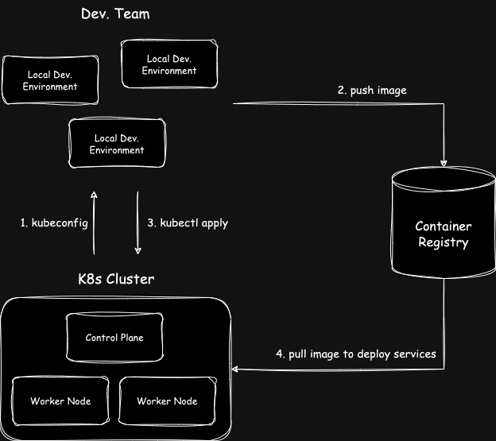
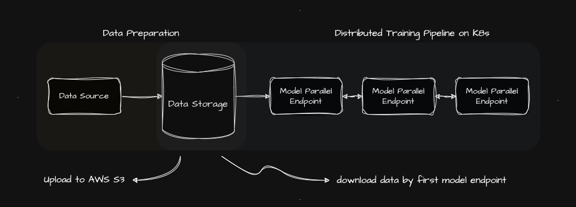

# Build distributed traininge image

在小型團隊、實驗環境等等，一個簡單的 K8s 開發流程如下圖：
 

在[第二章](/02_environment_setup/chapter2-2-kubernetes-setup.md)已經建置好了一個 K8s 集群，但實際上要部署什麼服務到 Cluster 內，就依照團隊需求而定。當團隊確定了開發項目後，會在團隊的實驗機器上進行開發，而經過嚴謹測試後，會將開發好的 Image 推送到 Container Registry，隨後，開發團隊會建立 `K8s 配置檔`，也就是用 `yaml` 組成的各個服務設定與串接設定等，最終使用 `kubectl apply` 將配置檔推送到 Cluster 內，在權限正確的情況下，Cluster 就會按照配置檔做服務的部署。

而在開始開發前，先確保開發機器上具備使用 `kubectl apply` 的能力且確保機器知道要推送的 Cluster 在哪。

## Preparation Work

未來的開發機上，都需要按照本節的說明來正確的和集群互動。而本節說明也參照[官方文件指令](https://kubernetes.io/zh-cn/docs/reference/kubectl/)進行。

## Distributed Training

