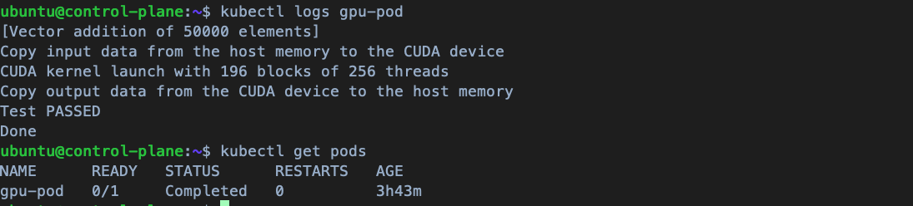

[第二章](/02_environment_setup/)已經設定好所有環境了，本篇就簡單看看是否每個節點都能順利運作。

## Services

玩玩看簡單的 Services 看看 Cluster 內的交互是否順利。

此 APP 包含兩個元件：問時間 ＆ 回答時間，就這麼簡單，程式碼在[這裡](./toy-test/)都找得到，主要就是起兩個 Flask API，外部用戶會打到第一個 API，然後第一個 API 會問第二個 API 時間，結束。

**注意：Flask 內的 host 記得設定成 0.0.0.0。**

## Pull Secrets

這點很重要，只要我們的 image 在私有儲存庫（所有非公開的，例如 AWS ECR）Kubernetes 就會需要憑證才能拉 Image。

所以我們依照 Kubernetes Framework 建立憑證 (control plane)：

```sh
aws ecr get-login-password --region us-east-1 | \
kubectl create secret docker-registry ecr-registry -n YOUR_NAMESPACE\
--docker-server=YOUR_ACCOUNT_ID.dkr.ecr.us-east-1.amazonaws.com \
--docker-username=AWS \
--docker-password=$(cat -) 
```

在這裡我們創造一個名叫 `ecr-registry` 的 Secrets，之後就可以寫入 yaml 內。

**注意：-n YOUR_NAMESPACE 可以不需要，不放就是預設 `default`，但要記得，`kubectl apply` 時若你的 yaml 有設特定的 namespace，那要確保該 namespace 底下有這個 key。**

## ECR

創建好兩個 image 後，記得 `docker build` 到環境底下，然後去 AWS ECR 創建 repository，我命名為 `luka-exp`，之後按照 `View push command` 一步一步把剛才建好的 image push to ECR。

記得存到 Cluster 區域內的 ECR，這樣不會跨區存取比較不會有問題。

## Deploy

在最外層建立好 Deploy 的 yaml file，Cluster 要開放對外的 Port，有很多選擇，這裡用 NodePort，也就是打到 Public IP 時，會自動導到對應的服務，無論是哪個 Public IP，只要存在 Cluster 的節點，都可以順利傳導請求。為什麼會這樣可以參考第一章提到的 [kube-proxy 說明](/01_kubernetes_introduction/chapter1-2-component-details.md#23-kube-proxy)

沒問題後，用以下指令把服務推上去：
```sh
kubectl apply -f ask-time-app-k8s-deploy.yaml
kubectl apply -f answer-time-app-k8s-deploy.yaml
kubectl apply -f service.yaml
kubectl apply -f service2.yaml
```

**注意：先設定環境變數 `export KUBECONFIG=/path/to/your/kubeconfig`，這樣就不用每次 kubectl apply 還要 --kubeconfig。**

好了後，使用 `curl http://YOUR_NODE_PUBLIC_IP:30000/ask_time` 應該就會有時間了，如果回應太久，要去檢查 Security Group 有沒有設定正確，如果 Internal Server Error 通常就是 Service 內部有問題，可以進去 Pod 內看 `kubectl exec -it <pod-name> -- bash` 或是先看看 Log `kubectl logs <pod-name>`。

## Kubernetes GPU Setting

在 Kubernetes Framework 中，記得除了宿主機要有 GPU Driver 外，Cluster 也要安裝。參考[這裡](https://kubernetes.io/zh-cn/docs/tasks/manage-gpus/scheduling-gpus/)。

而我目前使用的是 Nvidia T4 的 GPU，所以依照官方指引，可以去 [Nvidia Github](https://github.com/NVIDIA/k8s-device-plugin#quick-start) 看如何安裝對應的套件。

先透過 `dpkg -l 'nvidia*'` 檢查版本號跟官方是否一致。

### Container Runtime (ALL GPU NODEs)

每個不同的 Container Runtime 要做相對應的設定，依照 [Nvidia 提供文件](https://docs.nvidia.com/datacenter/cloud-native/container-toolkit/latest/install-guide.html#configuring-containerd-for-kubernetes)，針對我們自己的 `Containerd` 做以下設定：

```sh
sudo nvidia-ctk runtime configure --runtime=containerd
```

跑完後，系統會自動在 `/etc/containerd/config.toml` 新增 Nvidia 的相關參數配置。

但是重點沒有改預設的 runtime，因此一樣要到 `/etc/containerd/config.toml` 內，手動更改以下參數:
`default_runtime_name` 原本是 `runc`，針對所有 GPU 機器，請改成 `nvidia`
```sh
[plugins."io.containerd.grpc.v1.cri".containerd]
    default_runtime_name = "nvidia"
```

最後重啟

```sh
sudo systemctl restart containerd
```

### Control Plane Nvidia Plugin

所有節點的 Container Runtime 都設定好後，可以回 Control Plane 為集群安裝 Nvidia Plugin 了。


```sh
kubectl create -f https://raw.githubusercontent.com/NVIDIA/k8s-device-plugin/v0.17.0/deployments/static/nvidia-device-plugin.yml
```

之後我們 apply 一個測試案例看看：

```sh
cat <<EOF | kubectl apply -f -
apiVersion: v1
kind: Pod
metadata:
  name: gpu-pod
spec:
  restartPolicy: Never
  containers:
    - name: cuda-container
      image: nvcr.io/nvidia/k8s/cuda-sample:vectoradd-cuda12.5.0
      resources:
        limits:
          nvidia.com/gpu: 1 # requesting 1 GPU
  tolerations:
  - key: nvidia.com/gpu
    operator: Exists
    effect: NoSchedule
EOF
```

然後看看有沒有成功：

```sh
kubectl logs gpu-pod
```

