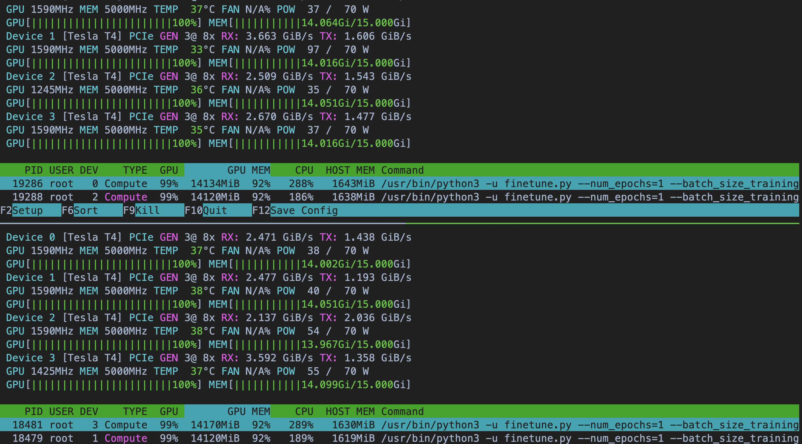
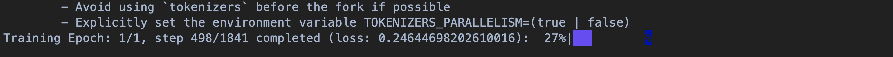

# Build distributed traininge image

最後，我們將實作一個 [Pytorch FSDP (Fully Sharded Data Parallel)](https://pytorch.org/tutorials/intermediate/FSDP_adavnced_tutorial.html) 的分散式訓練方法在已經建立好的 Cluster 內。

先到 AWS EC2，將機器 Worker Node 都改成有 GPU 的 Instance，我是使用 4 顆 NVIDIA T4 16GB GPU Memory，如果有更多錢可以開更大更快的 GPU Instance。但這裡只是為了串通好訓練流程，當訓練流程串通好後，未來無論模型多大，甚至到 175B 以上，都可以透過增加 Worker Node 或是加大 Worker Node 的機器大小來處理。

參考 [chapter3-0](/03_LLM_full_finetune_on_k8s/chapter3-1-simple-test.md) 設定 K8s GPU 的做法，確保 Cluster 能正確偵測到每個 Node 的 GPU。

## Distributed Training Overview

Pytorch 已經實作完多節點多 GPU 的 Framework - **torch.distributed**。例如 DDP, FSDP 等訓練方式，在模組內部已經將各個參數傳遞方式、更新方式、節點通訊方式等配置模板都實作完畢，我們只需要依照配置好參數，就可以依照此 Framework 實作分散式訓練。

在 **torch.distributed**，我們會用以下兩個強大的功能：

### torchrun (torch.distributed.launch)

torchrun，是 pytorch 進行分散式訓練的進入點，他提供環境配置的參數設定，告訴整個 **torch.distributed** 訓練環境的具體訊息（有哪幾個 Node，Node 的通訊位置，通訊方式，每個 Node 內有幾顆 GPU 等）。

在使用 torchrun 時，預設的 `init_process_group` 會幫我們讀取環境變數的資訊，也就是把參數放到環境變數內，torchrun 就可以自動讀取後進行配置。

並且當使用 torchrun 時，它會自動計算並分配以下變數：
- RANK: 每個節點/進程的全局 ID。
- WORLD_SIZE: 總進程數（=節點數×每節點的進程數）。
- LOCAL_RANK: 節點內部的 GPU 編號。
- MASTER_ADDR 和 MASTER_PORT: 協調節點通信所需的主機地址和端口。

因此你可能看到某些 github repo 中有使用這些環境變數，卻在各個 .env 檔案或文件上都找不到相關設定，是因為 torchrun 自動幫我們配置好了。

而在多節點的情況下（--nnodes > 1），torchrun 通過主節點與其他節點溝通，自動協調節點的啟動。

而在 torch.distributed 中，使用 **RDZV (Rendezvous Serve)** 的機制來和所有節點溝通。RDZV 是在多進程、多節點常見的機制。確保每個節點能夠依照需求同步處理、等待、啟動各自的任務。

舉例來說，我們有兩台機器，A 機器跟 B 機器同時跑訓練程式，但 A 機器要怎麼知道 B 機器開始跑了沒，跑到哪裡，何時要等待 B 機器傳遞交換參數的請求。這兩台機器分散訓練的痛點就是**無法進行訊息同步**，因此機器們不知何時該等待，何時該進行。而 RDZV 就是為了解決這個問題而存在的，torch.distributed 就針對此機制進行實作，當我們參數配置好後，torch.distributed 就會自動在每個節點的適當時機進行溝通、等待、參數傳遞、反向傳遞等。

在 torch.distributed 中，RDZV 的實作又以 **etcd** 和 **c10d** 為主。前者是由一個中心節點管控所有通訊，也就是會起一個中心服務，所有節點資訊同步都會和此節點交換訊息。而後者不會起一個額外的中心服務，但是還是會需要一個**位置能夠進行資訊交換，torchrun 使用（--rdzv-endpoint）來進行節點和節點間溝通的參數**，本次範例也會以後者為主。

### FSDP

而 FSDP 的核心概念就是將一個龐大模型內的參數切片分給多個 GPU，這樣就不需要在乎單個 GPU 大小，無論模型參數多大，只需要透過 GPU 擴增的方式都能進行訓練。想像一個模型內的參數都被均勻分組，每一組丟給一個 GPU 去跑訓練，大幅降低 GPU Memory 的消耗。

實作上，**會在每個 Node 都啟動 torchrun 的訓練指令**，而節點間藉由 RDZV 知道其他節點是否已經啟動 torchrun，如果尚未啟動則進行等待（注意：--nnodes 參數就是說明節點數量，因此 RDZV 會知道總共有多少節點要等）。

啟動後，先將模型透過 FSDP 模組包裝，使得每個節點的 Model 都是 FSDP 元件，並且要告訴此物件**包裝策略**，也就是跟 FSDP 說明模型內哪些參數需要被分散處理，要怎麼分割，例如將參數全部平均到所有 GPU 上。

此時，FSDP 就會將**包裝策略**說明好的參數分配策略，將各自所需的參數分配給各個相對應節點上的 GPU。因此每個節點的每個 GPU 都會有各自需要跑的參數。

而訓練過程中，假設我有兩顆 GPU，且模型有 10 層，每層都有 forward function, activation function，最後有 loss function。

依照預設的 FSDP 訓練框架，會把**資料分給兩顆 GPU**，此時每顆 GPU 會知道完整模型框架，**但是只會載入自己需要的參數**，接著每顆 GPU 都會 forward 10 層（**只是每層都只跑自己需要跑的參數，因此正常不需要通訊，只是如果某些層需要其他 GPU 的 fowrward 結果資訊，也會開啟通訊**），最後兩顆 GPU 都會過 loss function 產生各自的 gradient，**此時會藉由 RDZV 的機制開啟通訊，彙整所有局部 gradient**，也就是 Allreduce，整合所有 gradient 後，產生每一層需要調整的 gradient，之後**同步給所有 GPU**，此時每個 GPU 都會收到各自要調整的參數訊息，因此**每個 GPU 開始更新各自的參數**，最終完成完整的反向傳遞，然後跑第二個 training step。

這些 forward, activation, allreduce 等方法都依照 FSDP Framework 進行，而何時等待參數傳遞，何時運行各自任務，也一樣統一由 torch.distributed 包好，而能順利運行的中央通訊策略就是依照 RDZV 策略。


## Training

實作上，參考 `fsdp-training/` 內的文件，完全依循 [llama-recipes](https://github.com/meta-llama/llama-recipes) 的做法，資料也完全是預設。

未來串通訓練流程後，後續可以改成自己的資料，甚至改成其他 Huggingface Model。而所有 Python Code 全都在 [finetune.py](/03_LLM_full_finetune_on_k8s/fsdp-training/finetune.py)。

使用者只需要改 `.env.template` 即可，改成自己的環境後檔名換成 `.env`。隨後跑 `build.sh`，主要建立 k8s yaml file，最後跑 `run.sh` 即可。

若有微調的參數要調整，可以在 `.env.template` 內的 `CMD` 變數修改新增。例如有自己的資料，可以在 `CMD` 內指定資料集。

GPU 直接拉滿


記得，過程中的警告都要除掉，不然很有可能發生未預期錯誤（例如包裝策略有問題，可能會導致 loss 消失）

都沒問題的話，loss 應該會正常顯示 (`kubectl logs <pod-id>`)：



#### Note

1. 如果有 warning 說沒辦法通過某個 port 打到 c10d，例如什麼 ... The IPv6 network addresses of ...，可能是因為 c10d 還沒完全啟動後，我們的服務就先跑，可以透過以下方式檢查：
   1. `kubectl exec -it <pod name> -- bash` # 進去 pod 內看看
   2. `nc -zv <rdzv-host> <port>` 打到 c10d 在的位置，看網路是否通。

2. 初始化的時候，會有很多 `from torch.distributed._shard.checkpoint import`，就是機器開始對每顆 GPU Setup 環境，理論上有幾顆 GPU 就會有幾行上述的指令。

3. 如果有 libcuda.so 找不到之類的警告，請去該 Worker Node 設定 LD_LIBRARY_PATH 變數。

4. 如果有未預期的 foward 運行警告（錯誤）如下，一定要修正，有可能是模型在進行 FSDP 包裝時有問題，參考下面第五點。
   
```sh
UserWarning: Forward order differs from that of the first iteration on rank 7. Collectives are unchecked and may give incorrect results or hang.
```

5. 針對不同的模型要有不同的包裝策略（可以用簡單的機器 load 完後直接印出來，再把對應的 layer 取代在 `transformer_layer_cls` 內，例如 Llama 3：

```Python
def get_llama_wrapper():
    """we register our main layer class and use the fsdp transformer wrapping policy
    ensures embedding layers are in the root fsdp unit for shared access and that fsdp units map to transformer layers
    """
    # ====   use new transformer wrapper
    # file: llama_recipes/policies/wrapping.py:get_llama_wrapper

    llama_auto_wrap_policy = functools.partial(
        transformer_auto_wrap_policy,
        transformer_layer_cls={
            LlamaDecoderLayer,
        },
    )

    return llama_auto_wrap_policy
```